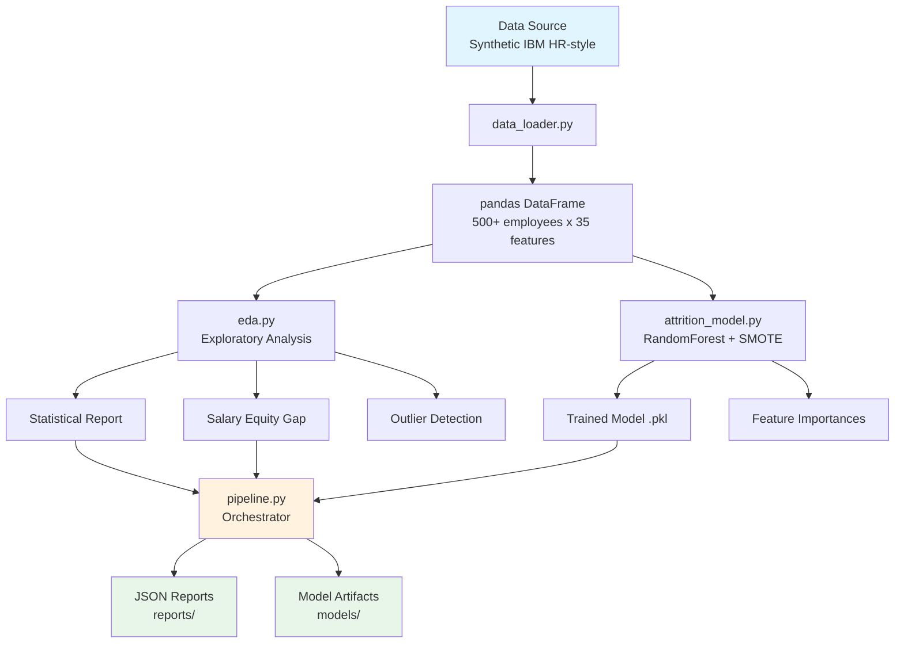
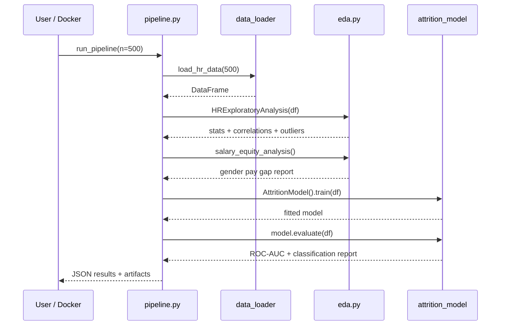

# pandas-data-analysis-hr

[](https://github.com/galafis/pandas-data-analysis-hr/actions)
[](https://python.org)
[](LICENSE)
[](https://github.com/psf/black)

---

> **EN:** End-to-end People Analytics pipeline built on Python and Pandas. Covers exploratory data analysis (EDA), attrition prediction, salary equity audit, and workforce segmentation. Production-ready pipeline with Docker, CI and bilingual docs.

> **PT-BR:** Pipeline completo de People Analytics com Python e Pandas. Abrange analise exploratoria de dados (EDA), predicao de turnover, auditoria de equidade salarial e segmentacao da forca de trabalho. Pipeline production-ready com Docker, CI e documentacao bilingue.

---

## Table of Contents / Sumario

- [Architecture / Arquitetura](#architecture--arquitetura)
- [Features / Funcionalidades](#features--funcionalidades)
- [Quick Start / Inicio Rapido](#quick-start--inicio-rapido)
- [Project Structure / Estrutura do Projeto](#project-structure--estrutura-do-projeto)
- [Usage / Uso](#usage--uso)
- [Testing / Testes](#testing--testes)
- [Docker](#docker)
- [API Reference / Referencia da API](#api-reference--referencia-da-api)
- [Contributing / Contribuicao](#contributing--contribuicao)
- [License / Licenca](#license--licenca)

---

## Architecture / Arquitetura





---

## Features / Funcionalidades

### EN

| Feature | Description |
|---------|-------------|
| **Synthetic Data Generation** | IBM HR Attrition-style dataset with 35 features per employee |
| **Exploratory Data Analysis** | Descriptive statistics, skewness, kurtosis, missing data profiling |
| **Correlation Analysis** | Pearson/Spearman/Kendall matrices, top-N correlation pairs |
| **Attrition Modeling** | RandomForest classifier with SMOTE for class imbalance |
| **Salary Equity Audit** | Gender pay gap analysis with optional control variables (dept, level) |
| **Outlier Detection** | IQR-based outlier flagging across all numeric features |
| **Data Quality Report** | Comprehensive dtype, null, unique value profiling |
| **Feature Importance** | Ranked feature importances from the trained model |
| **Pipeline Orchestration** | End-to-end workflow with artifact persistence |
| **Docker Support** | Multi-stage Dockerfile for reproducible execution |
| **CI/CD** | GitHub Actions with lint + test on every push |
| **Bilingual Docs** | Full documentation in English and Portuguese |

### PT-BR

| Funcionalidade | Descricao |
|---------------|-----------|
| **Geracao de Dados Sinteticos** | Dataset estilo IBM HR Attrition com 35 features por funcionario |
| **Analise Exploratoria** | Estatisticas descritivas, assimetria, curtose, perfil de dados faltantes |
| **Analise de Correlacao** | Matrizes Pearson/Spearman/Kendall, top-N pares correlacionados |
| **Modelagem de Attrition** | Classificador RandomForest com SMOTE para desbalanceamento |
| **Auditoria de Equidade Salarial** | Analise de gap salarial por genero com variaveis de controle |
| **Deteccao de Outliers** | Deteccao baseada em IQR em todas as features numericas |
| **Relatorio de Qualidade** | Perfil completo de dtype, nulos e valores unicos |
| **Importancia de Features** | Features ranqueadas pelo modelo treinado |
| **Orquestracao do Pipeline** | Workflow end-to-end com persistencia de artefatos |
| **Suporte Docker** | Dockerfile multi-stage para execucao reproduzivel |
| **CI/CD** | GitHub Actions com lint + teste em cada push |
| **Docs Bilingue** | Documentacao completa em Ingles e Portugues |

---

## Quick Start / Inicio Rapido

### Prerequisites / Pre-requisitos

- Python 3.10+
- pip or Docker

### Installation / Instalacao

```bash
# Clone the repository / Clone o repositorio
git clone https://github.com/galafis/pandas-data-analysis-hr.git
cd pandas-data-analysis-hr

# Create virtual environment / Crie o ambiente virtual
python -m venv venv
source venv/bin/activate  # Linux/Mac
# venv\Scripts\activate   # Windows

# Install dependencies / Instale as dependencias
pip install -r requirements.txt
```

### Run the Pipeline / Execute o Pipeline

```bash
# Run with default settings (500 employees)
python -m src.pipeline

# Custom number of employees
N_EMPLOYEES=1000 python -m src.pipeline

# With debug logging
LOG_LEVEL=DEBUG python -m src.pipeline
```

---

## Project Structure / Estrutura do Projeto

```
pandas-data-analysis-hr/
├── .github/
│   └── workflows/
│       └── ci.yml              # CI/CD pipeline
├── docs/
│   └── architecture.md         # Architecture docs with Mermaid
├── src/
│   ├── __init__.py             # Package init
│   ├── data_loader.py          # Synthetic HR data generator
│   ├── eda.py                  # Exploratory data analysis
│   ├── attrition_model.py      # ML attrition classifier
│   └── pipeline.py             # End-to-end orchestrator
├── tests/
│   ├── __init__.py
│   ├── test_data_loader.py     # Data loader tests
│   ├── test_eda.py             # EDA module tests (16 tests)
│   └── test_attrition_model.py # Model tests (10 tests)
├── data/                       # Generated at runtime
├── models/                     # Saved model artifacts
├── reports/                    # Generated JSON reports
├── .env.example                # Environment variables template
├── Dockerfile                  # Multi-stage Docker build
├── Makefile                    # Dev commands
├── requirements.txt            # Python dependencies
├── LICENSE                     # MIT License
└── README.md                   # This file
```

---

## Usage / Uso

### Python API

```python
from src.data_loader import load_hr_data
from src.eda import HRExploratoryAnalysis
from src.attrition_model import AttritionModel

# 1. Load data / Carregar dados
df = load_hr_data(n_employees=500)

# 2. Exploratory Analysis / Analise Exploratoria
eda = HRExploratoryAnalysis(df)
stats = eda.summary_statistics()
correlations = eda.top_correlations(n=10)
outliers = eda.detect_outliers_iqr()

# 3. Salary Equity / Equidade Salarial
equity = eda.salary_equity_analysis(
    salary_col="MonthlyIncome",
    group_col="Gender",
    control_cols=["Department", "JobLevel"]
)
print(f"Gender pay gap: {equity['overall']['gap_pct']:.2f}%")

# 4. Attrition rates / Taxas de Attrition
rates = eda.attrition_rate_by("Department")

# 5. Train model / Treinar modelo
model = AttritionModel(random_state=42)
model.train(df)
metrics = model.evaluate(df)
print(f"ROC-AUC: {metrics['roc_auc']:.4f}")

# 6. Feature importance
fi = model.feature_importance()
print(fi.head(10))

# 7. Save/Load model / Salvar/Carregar modelo
model.save("models/my_model.pkl")
loaded = AttritionModel.load("models/my_model.pkl")
```

### Makefile Commands

```bash
make install    # Install dependencies
make test       # Run pytest
make lint       # Run flake8
make run        # Run pipeline
make docker     # Build Docker image
make clean      # Remove artifacts
```

---

## Testing / Testes

```bash
# Run all tests / Executar todos os testes
pytest tests/ -v

# Run with coverage / Executar com cobertura
pytest tests/ -v --cov=src --cov-report=term-missing

# Run specific test file / Executar arquivo especifico
pytest tests/test_eda.py -v
pytest tests/test_attrition_model.py -v
```

### Test Coverage

| Module | Tests | Coverage |
|--------|-------|----------|
| `data_loader.py` | test_data_loader.py | Data loading, schema validation |
| `eda.py` | test_eda.py | 16 tests: stats, correlations, equity, outliers |
| `attrition_model.py` | test_attrition_model.py | 10 tests: train, predict, save/load, encoding |

---

## Docker

```bash
# Build / Construir
docker build -t pandas-hr-analytics .

# Run pipeline / Executar pipeline
docker run --rm pandas-hr-analytics

# Run with custom settings / Executar com config customizada
docker run --rm -e N_EMPLOYEES=1000 -e LOG_LEVEL=DEBUG pandas-hr-analytics

# Mount volume for artifacts / Montar volume para artefatos
docker run --rm -v $(pwd)/output:/app/reports pandas-hr-analytics
```

---

## API Reference / Referencia da API

### `HRExploratoryAnalysis`

| Method | Description / Descricao |
|--------|------------------------|
| `summary_statistics()` | Extended descriptive stats with skew/kurtosis |
| `categorical_summary()` | Value counts and proportions for categorical cols |
| `correlation_matrix(method, threshold)` | Correlation matrix with optional threshold filter |
| `top_correlations(n, method)` | Top-N strongest feature correlations |
| `attrition_rate_by(group_col)` | Attrition rate grouped by any categorical column |
| `salary_equity_analysis(salary_col, group_col, control_cols)` | Pay gap analysis with optional controls |
| `detect_outliers_iqr(columns, factor)` | IQR-based outlier detection |
| `data_quality_report()` | Comprehensive data quality profiling |
| `generate_report()` | Full EDA report as dictionary |

### `AttritionModel`

| Method | Description / Descricao |
|--------|------------------------|
| `train(df)` | Fit RandomForest with SMOTE on HR data |
| `predict_proba(df)` | Return attrition probability per employee |
| `evaluate(df)` | Compute ROC-AUC and classification report |
| `feature_importance()` | Ranked feature importances DataFrame |
| `save(path)` / `load(path)` | Persist/restore model with pickle |

---

## Contributing / Contribuicao

**EN:** Contributions are welcome! Please open an issue or submit a pull request.

**PT-BR:** Contribuicoes sao bem-vindas! Abra uma issue ou envie um pull request.

---

## License / Licenca

This project is licensed under the MIT License - see the [LICENSE](LICENSE) file for details.

Este projeto esta licenciado sob a Licenca MIT - veja o arquivo [LICENSE](LICENSE) para detalhes.

---

**Author / Autor:** Gabriel Demetrios Lafis
**GitHub:** [@galafis](https://github.com/galafis)
