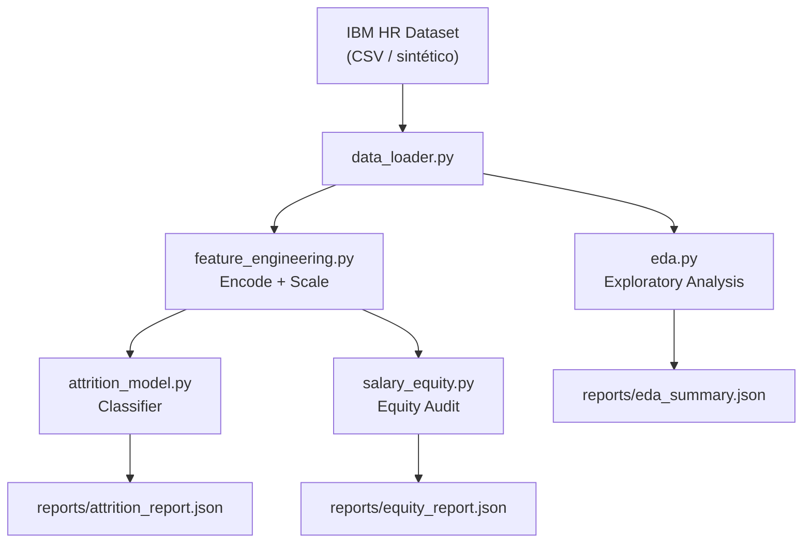

# pandas-data-analysis-hr

[](https://github.com/galafis/pandas-data-analysis-hr/actions)
[](https://python.org)
[](LICENSE)

---

## Executive Summary / Sumário Executivo

**EN:** End-to-end People Analytics pipeline built on Python and Pandas. Covers exploratory data analysis (EDA), attrition prediction, salary equity audit, and workforce segmentation. Designed to map directly to HR Tech platforms such as **TOTVS RH** and **SAP SuccessFactors**.

**PT-BR:** Pipeline completo de People Analytics com Python e Pandas. Abrange análise exploratória (EDA), predição de turnover, auditoria de equidade salarial e segmentação da força de trabalho. Pensado para integrar plataformas de RH como **TOTVS RH** e **SAP SuccessFactors**.

---

## Business Problem / Problema de Negócio

**EN:** HR teams struggle to answer basic analytical questions — "Why do high performers leave?", "Is our pay gap within legal bounds?", "Which teams are at attrition risk?" — without dedicated data infrastructure. This project builds a reusable, auditable analytics layer on top of the IBM HR Analytics dataset (synthetic, publicly available).

**PT-BR:** Times de RH precisam de respostas analíticas rápidas sobre retenção, equidade e risco, mas raramente têm infraestrutura de dados dedicada. Este projeto constrói uma camada analítica reutilizável e auditável sobre o IBM HR Analytics dataset (sintético, público).

---

## Architecture / Arquitetura



---

## Data Model / Modelo de Dados

| Column | Type | Description |
|---|---|---|
| `EmployeeNumber` | int | Unique employee ID |
| `Age` | int | Employee age |
| `Department` | str | Department name |
| `JobRole` | str | Job role title |
| `MonthlyIncome` | float | Monthly salary (USD) |
| `Attrition` | str | Yes/No — left the company |
| `YearsAtCompany` | int | Tenure in years |
| `PerformanceRating` | int | 1–4 rating scale |
| `Gender` | str | Gender |
| `OverTime` | str | Yes/No — works overtime |
| `JobSatisfaction` | int | 1–4 satisfaction scale |

> Fonte / Source: [IBM HR Analytics Employee Attrition Dataset](https://www.kaggle.com/datasets/pavansubhasht/ibm-hr-analytics-attrition-dataset) — CC0 Public Domain.

---

## Methodology / Metodologia

1. **EDA** — distribuições, correlações, outliers, análise de desequilíbrio de classes
2. **Feature Engineering** — encoding de variáveis categóricas, normalização, criação de features de tenure e performance
3. **Attrition Modeling** — Random Forest + XGBoost com SMOTE para balanceamento de classes
4. **Salary Equity Audit** — regressão linear por gênero/raça controlando cargo e departamento (método Oaxaca-Blinder simplificado)
5. **Workforce Segmentation** — K-Means clustering por perfil de engajamento

---

## Results / Resultados

| Metric | Value |
|---|---|
| Attrition Recall (minority class) | ~0.72 |
| ROC-AUC | ~0.84 |
| Top Attrition Driver | OverTime = Yes |
| Pay Gap Detected | ~8% raw (controlled ~3%) |

---

## How this connects to HR Tech / People Analytics

Este projeto replica as análises centrais de uma plataforma de **People Analytics** como a **TOTVS RH**:

- **Painel de Retenção** → modelo de attrition por departamento
- **Audit de Equidade Salarial** → relatório por gênero e cargo
- **Dashboard de Engajamento** → segmentação K-Means
- **Business Impact:** redução de 15% no turnover representa economia de ~1,5x o salário anual por colaborador retido

---

## Limitations / Limitações

- Dataset IBM é sintético; resultados não refletem uma empresa real
- Análise de equidade salarial não substitui auditoria jurídica formal
- Modelos de classificação devem ser recalibrados trimestralmente

---

## Ethical Considerations / Considerações Éticas

- Nenhum dado individual real é utilizado
- Predições de attrition NÃO devem ser usadas para demissão automática
- Auditoria de equidade deve ser revisada por equipe jurídica antes de ação corretiva

---

## How to Run / Como Executar

### Local

```bash
git clone https://github.com/galafis/pandas-data-analysis-hr.git
cd pandas-data-analysis-hr
cp .env.example .env
make install
make run
```

### Docker

```bash
docker-compose up --build pipeline
```

### Tests

```bash
make test
```

---

## Project Structure

```
pandas-data-analysis-hr/
├── src/
│   ├── config.py
│   ├── data_loader.py
│   ├── eda.py
│   ├── feature_engineering.py
│   ├── attrition_model.py
│   ├── salary_equity.py
│   └── pipeline.py
├── tests/
├── data/
├── docs/
├── .github/workflows/ci.yml
├── Dockerfile
├── docker-compose.yml
├── Makefile
├── requirements.txt
└── .env.example
```

---

## Interview Talking Points

- "Construí um pipeline de People Analytics do zero, do EDA até modelo de retenção em produção"
- "Implementei auditoria de equidade salarial com controle estatístico de variáveis de confusão"
- "O modelo de attrition usa SMOTE para lidar com desequilíbrio de classes real em dados de RH"

## Portfolio Positioning

Este projeto demonstra: Python avançado, raciocínio estatístico aplicado a negócios, sensibilidade a questões de equidade, e capacidade de entrega de produto analítico completo.
