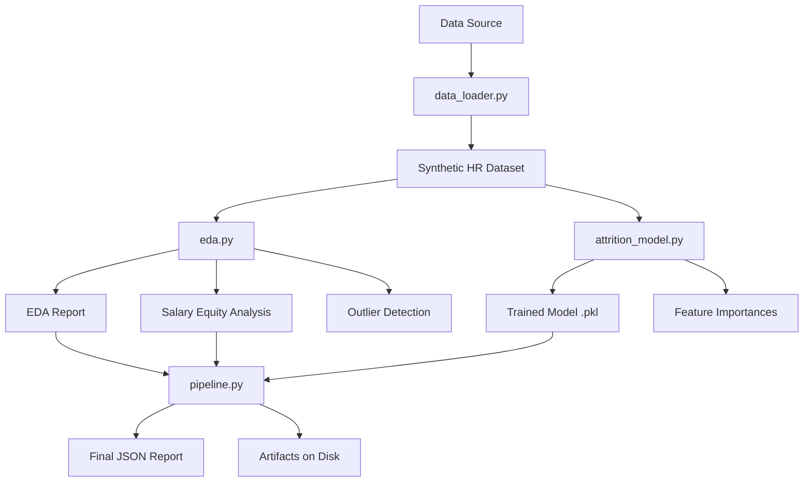
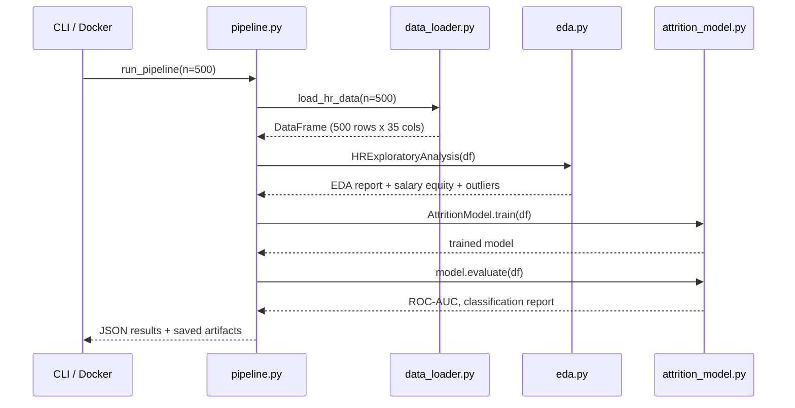
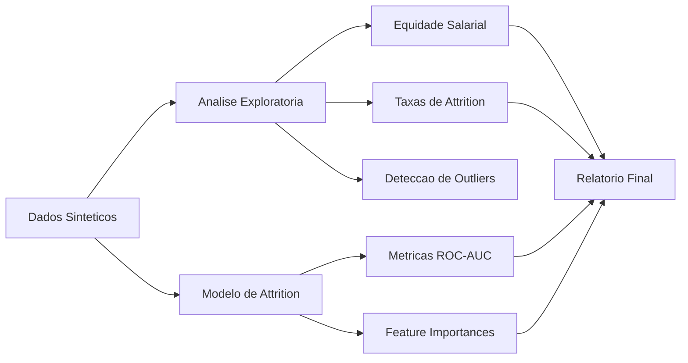

# Architecture / Arquitetura

## English

### System Architecture



### Pipeline Flow



### Module Responsibilities

| Module | Responsibility |
|--------|---------------|
| `data_loader.py` | Generate synthetic IBM HR-style data or load from CSV |
| `eda.py` | Statistical analysis, correlations, outlier detection, salary equity |
| `attrition_model.py` | RandomForest classifier with SMOTE for class imbalance |
| `pipeline.py` | Orchestrate all steps, save artifacts, generate reports |

### Directory Structure

```
pandas-data-analysis-hr/
├── .github/workflows/ci.yml   # CI/CD with GitHub Actions
├── docs/                       # Documentation
│   └── architecture.md
├── src/                        # Source code
│   ├── __init__.py
│   ├── data_loader.py          # Data loading & generation
│   ├── eda.py                  # Exploratory data analysis
│   ├── attrition_model.py      # ML model for attrition
│   └── pipeline.py             # End-to-end orchestrator
├── tests/                      # Unit tests (pytest)
│   ├── __init__.py
│   ├── test_data_loader.py
│   ├── test_eda.py
│   └── test_attrition_model.py
├── data/                       # Generated at runtime
│   ├── raw/
│   └── processed/
├── models/                     # Saved model artifacts
├── reports/                    # Generated reports
├── .env.example                # Environment variables template
├── Dockerfile                  # Multi-stage Docker build
├── Makefile                    # Dev commands (test, lint, run)
├── requirements.txt            # Python dependencies
├── LICENSE                     # MIT License
└── README.md                   # Bilingual documentation
```

---

## Portugues (PT-BR)

### Arquitetura do Sistema

O pipeline segue uma arquitetura modular com separacao clara de responsabilidades:

1. **Camada de Dados** (`data_loader.py`): Gera dados sinteticos no estilo IBM HR Attrition ou carrega CSVs existentes.
2. **Camada Analitica** (`eda.py`): Estatisticas descritivas, correlacoes, deteccao de outliers e analise de equidade salarial.
3. **Camada de Modelagem** (`attrition_model.py`): Classificador RandomForest com SMOTE para balanceamento de classes.
4. **Camada de Orquestracao** (`pipeline.py`): Executa todas as etapas sequencialmente, salva artefatos e gera relatorios.

### Fluxo de Dados



### Tecnologias Utilizadas

| Tecnologia | Uso |
|-----------|-----|
| Python 3.10+ | Linguagem principal |
| Pandas | Manipulacao e analise de dados |
| Scikit-learn | Modelagem preditiva |
| imbalanced-learn | SMOTE para classes desbalanceadas |
| Pytest | Testes unitarios |
| Docker | Containerizacao |
| GitHub Actions | CI/CD |
